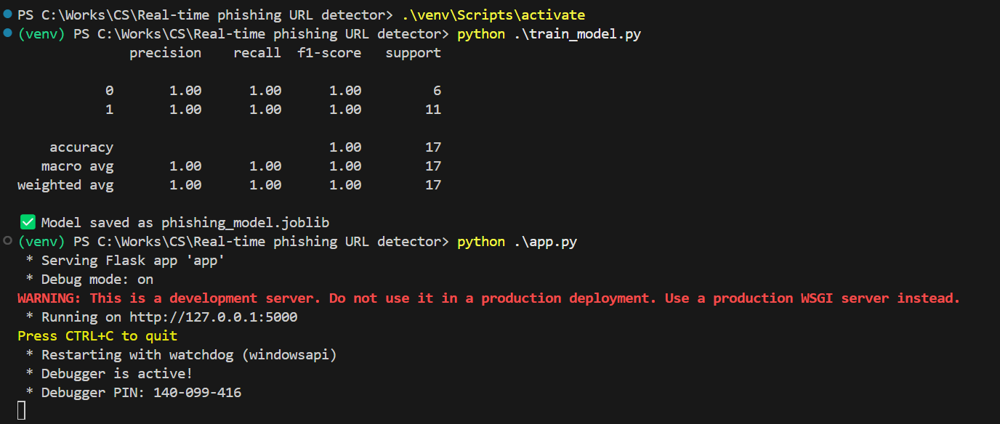
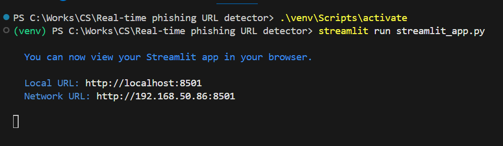
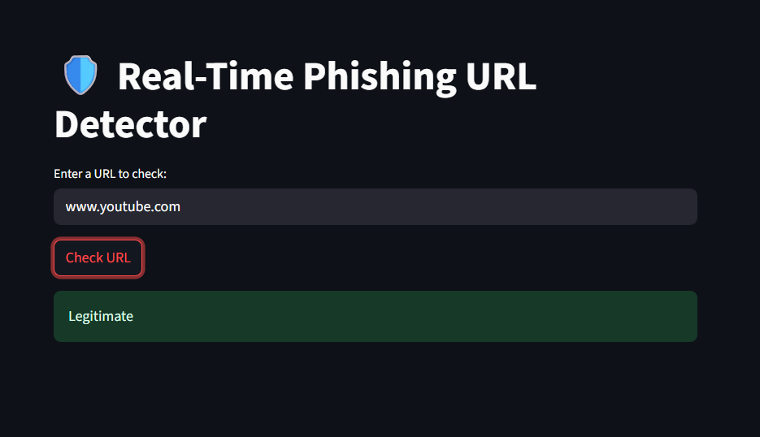
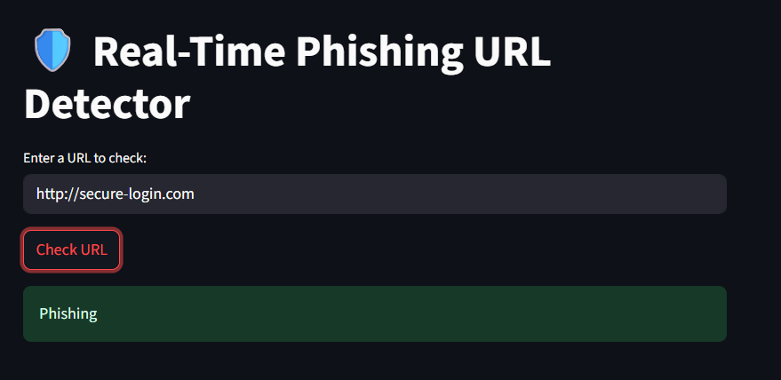

# Phishing URL Detector

A Flask-based web application that can detect whether a given URL is a phishing website or not.

## Installation

1. Clone the repository:
   ```
   git clone https://github.com/Auroshaa/Real-time-phishing-URL-detector.git
   ```
2. Navigate to the project directory:
   ```
   cd Real-time-phishing-URL-detector
   ```
3. Create a virtual environment and activate it:
   ```
   python -m venv venv
   source venv/bin/activate
   ```
4. Install the required dependencies:
   ```
   pip install -r requirements.txt
   ```

## Usage

1. Start the Flask application:
   ```
   python train_model.py
   python app.py
   ```
   

2. The application will be running at `http://localhost:5000`.
3. To use the API, send a POST request to `/predict` with a JSON payload containing the `url` field:
   ```
   curl -X POST -H "Content-Type: application/json" -d '{"url": "https://example.com"}' http://localhost:5000/predict
   ```
4. The response will be a JSON object with the `url` and `result` (either "Phishing" or "Legitimate") fields.
5. Run the Streamlit in another terminal
    ```
    .\venv\Scripts\activate
    streamlit run streamlit_app.py
    ```
   
## API

The application exposes a single API endpoint:

- **POST `/predict`**
  - **Request Body**: `{"url": "https://example.com"}`
  - **Response**: `{"url": "https://example.com", "result": "Legitimate"}`

## Contributing

1. Fork the repository.
2. Create a new branch for your feature or bug fix.
3. Make your changes and commit them.
4. Push your branch to your forked repository.
5. Submit a pull request to the main repository.

## License

This project is licensed under the [MIT License](LICENSE).

## Output
```
Web URL : http://localhost:8501/
```




